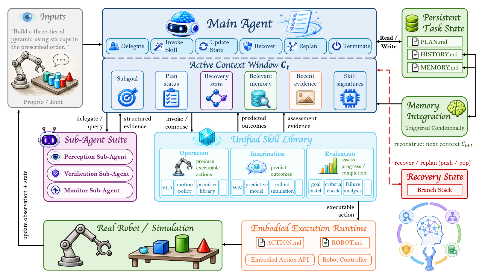

## Overview

This project deploys an agentic vision-language-action (VLA) system on a physical PiPER robotic arm. The system combines inverse kinematics for approaching a target object with VLA-based control for grasp execution.

## EMERGE-Policy

The accompanying paper, **EMERGE-Policy: A Robot Mind Emerges Beyond a Single Policy**, frames robot intelligence as a coordinated system rather than one monolithic policy. A Main Agent keeps compact task state and decomposes instructions into subgoals, while isolated Perception, Verification, Monitor, and Memory Sub Agents return only structured evidence. A unified Skill interface lets the agent compose Operational, Imagination, and Evaluation capabilities across VLA, world-model, analytical, and verification backends.

[Read the paper on arXiv](https://arxiv.org/abs/2608.29896).

*EMERGE-Policy coordinates planning, prediction, execution, verification, memory, and localized recovery in a closed loop.*

The key mechanism is criterion-grounded recovery: verified success advances the plan, while a failure produces a textual diagnosis and pushes a localized recovery objective onto a Branch Stack before global replanning. Persistent task files and token-aware memory preserve progress across long-horizon manipulation without requiring fine-tuning of the underlying VLA.

## Key Contributions

- Deployed an agentic VLA system on a physical PiPER robotic arm.
- Integrated inverse kinematics for object approach.
- Used VLA-based control for grasp execution.

## Results

The paper reports system-level gains on simulation benchmarks and a physical cup-stacking task:

- **LIBERO:** 99.2% average success with the world-model pathway, compared with 98.5% for the Cosmos Policy backend; the π0.5 pathway reaches 98.8% versus 96.8% for the underlying policy.
- **LIBERO-Plus:** 93.9% average success under seven perturbations, compared with 82.2% for Cosmos Policy. Removing imagination and selection drops the average to 85.1%.
- **LIBERO-Pro:** 77.8% on implicit instructions, including 95.7% on Spatial-S and 59.1% on LIBERO-10-S.
- **Physical cup stacking:** 100 real-robot trials demonstrate long-horizon planning, perception, verification, and recovery. Success remains 92% with moderate cup-size changes and 93-94% under color changes; interruption recovery reaches 86%.
- **Execution efficiency:** task-specific priors reduce planning steps by 24.7% and wall-clock time by 16.3% while maintaining comparable success rates.

## Demonstrations

### Cup arrangement

The agentic VLA system identifies and manipulates cups arranged on the work surface.

<figure class="project-video">
  <video controls preload="metadata" playsinline poster="cups-poster.jpg">
    <source src="cups.webm" type="video/webm">
    <source src="cups.mp4" type="video/mp4">
    Your browser does not support embedded video.
  </video>
  <figcaption>Physical robot-arm demonstration with a cup arrangement task.</figcaption>
</figure>

### Opening a drawer

The robot approaches a drawer and executes the opening action with VLA-based control.

<figure class="project-video">
  <video controls preload="metadata" playsinline poster="open-drawer-poster.jpg">
    <source src="open-drawer.webm" type="video/webm">
    <source src="open-drawer.mp4" type="video/mp4">
    Your browser does not support embedded video.
  </video>
  <figcaption>Physical robot-arm demonstration of opening a drawer.</figcaption>
</figure>
