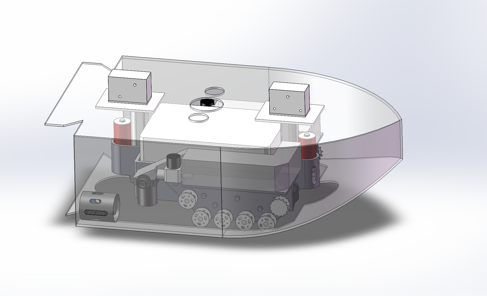
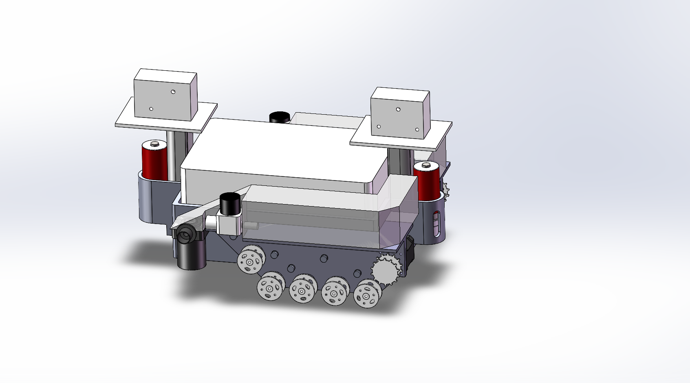
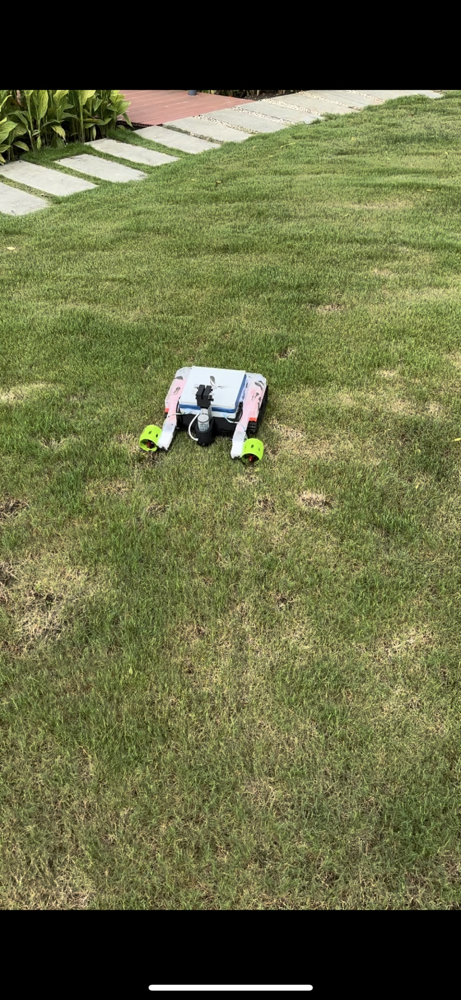
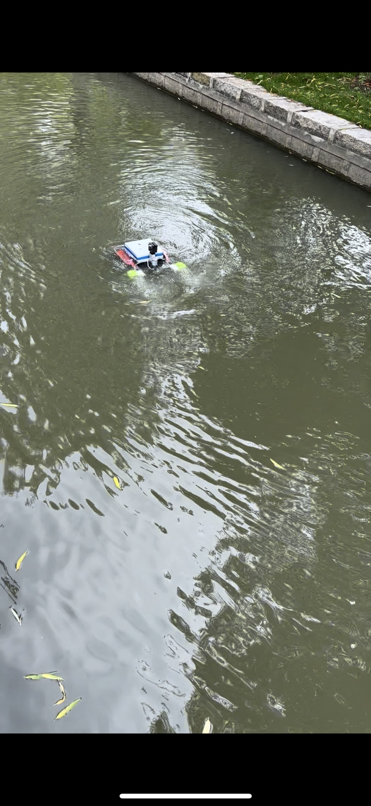
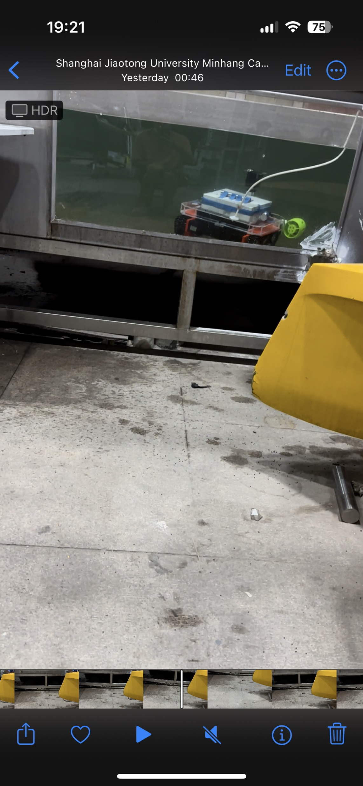
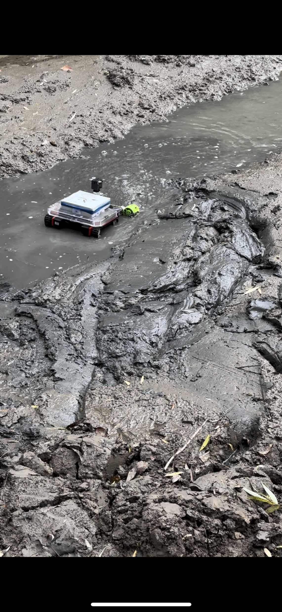
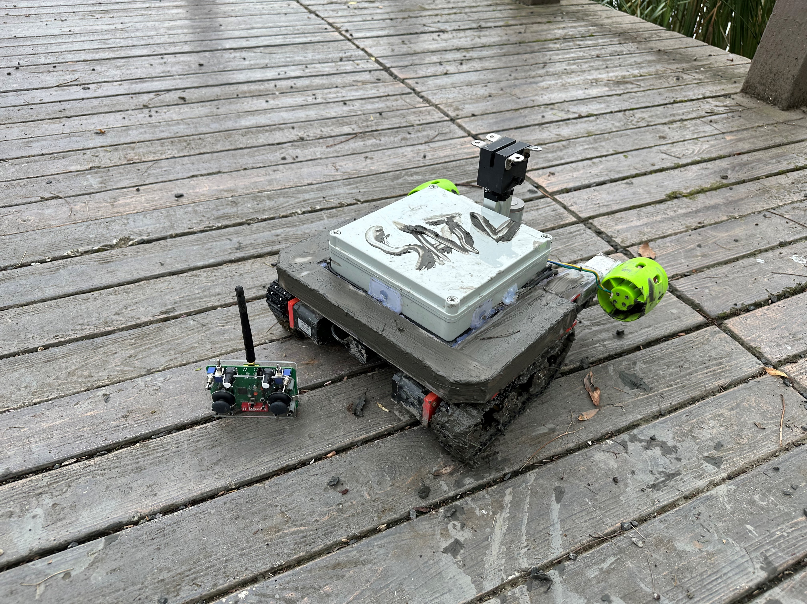
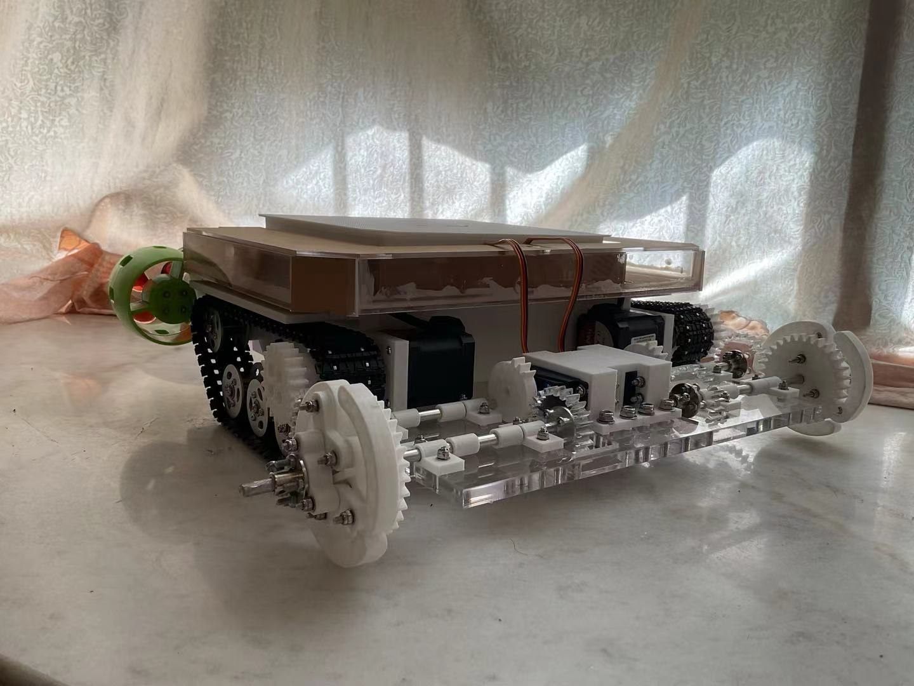
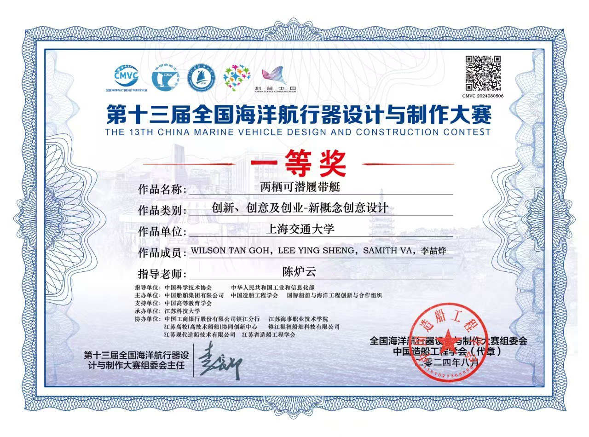
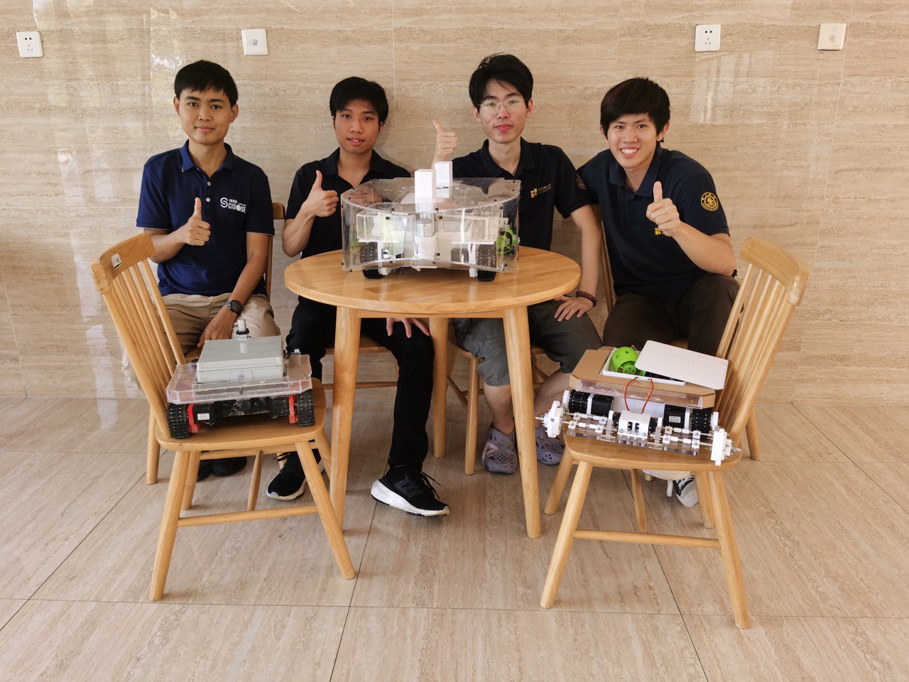

## Overview

Developed through the SJTU Undergraduate Research Program, this project explored a submersible unmanned platform that can travel across deep water, shallow water, mudflats, and land. The vehicle combines marine propulsion with retractable tracks so it can approach underwater, transition at the shoreline, and continue over difficult terrain.

The project was completed with Wilson Tan Goh, Lee Ying Sheng, and Li Zheye under the guidance of Chen Luyun.

## Motivation

Conventional amphibious platforms can struggle with waves near the shoreline and soft, uneven terrain. Our design uses submerged travel for a more stable and discreet approach, propellers for movement in water, and tracks for mudflat and land mobility.

## Mechanical Design





The platform consists of five main subsystems:

- **Power system:** propulsion and actuator power for water and land operation.
- **Marine propulsion system:** propellers for surface and submerged travel.
- **Control system:** Arduino Uno and Mega controllers with motor drivers, relays, electronic speed controllers, and a custom circuit board.
- **Retractable track system:** raises the tracks to reduce hydrodynamic drag and lowers them for shore landing and ground travel.
- **Hull and ballast system:** provides buoyancy control and protects the internal mechanism.

## Operating Modes

The prototype demonstrated four connected capabilities: rough-terrain travel, surface navigation, submerged navigation, and water-to-land transition. A ballast tank is filled through valves and emptied with a pump to control diving and surfacing. The retractable track mechanism switches the vehicle between efficient water propulsion and tracked locomotion.





## Prototype Development

The design progressed through multiple hardware iterations. The initial prototype established the tracked control platform, the second generation integrated the transparent amphibious hull, and the extended prototype explored a revised track and lifting mechanism. Component-level iterations also improved the lifting-rod mount, track frame, and lifting-rod cap.





## Key Contributions

- Designed and implemented the vehicle's embedded control system.
- Integrated propeller propulsion, ballast control, and retractable tracks.
- Tested surface travel, diving and surfacing, underwater navigation, rough-terrain mobility, and shore landing.
- Contributed to iterative mechanical and system-level prototype development.

## Demo

<figure class="project-video">
  <video controls preload="metadata" playsinline poster="demo-poster.jpg">
    <source src="demo.mp4" type="video/mp4">
    Your browser does not support embedded video.
  </video>
  <figcaption>Full-process prototype demonstration, including water operation and the transition toward land.</figcaption>
</figure>

## Recognition

The project received First Prize at the 13th National Marine Vehicle Design and Production Competition and a Special Prize in the Yangtze River Delta regional competition.




