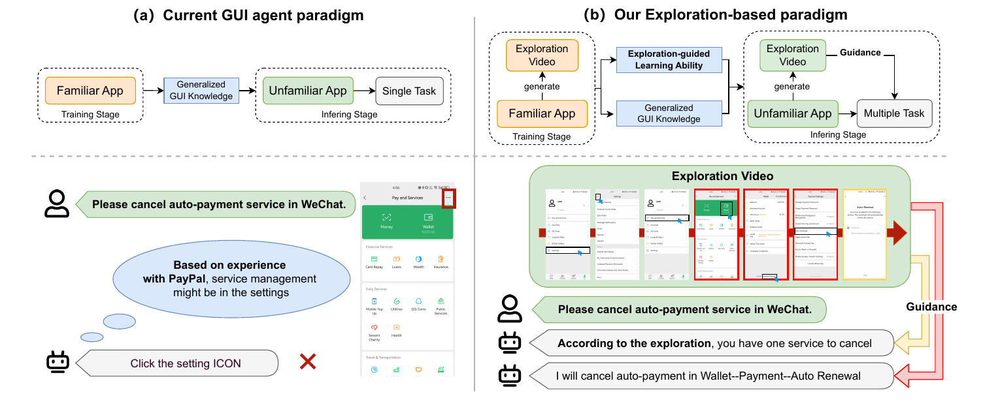
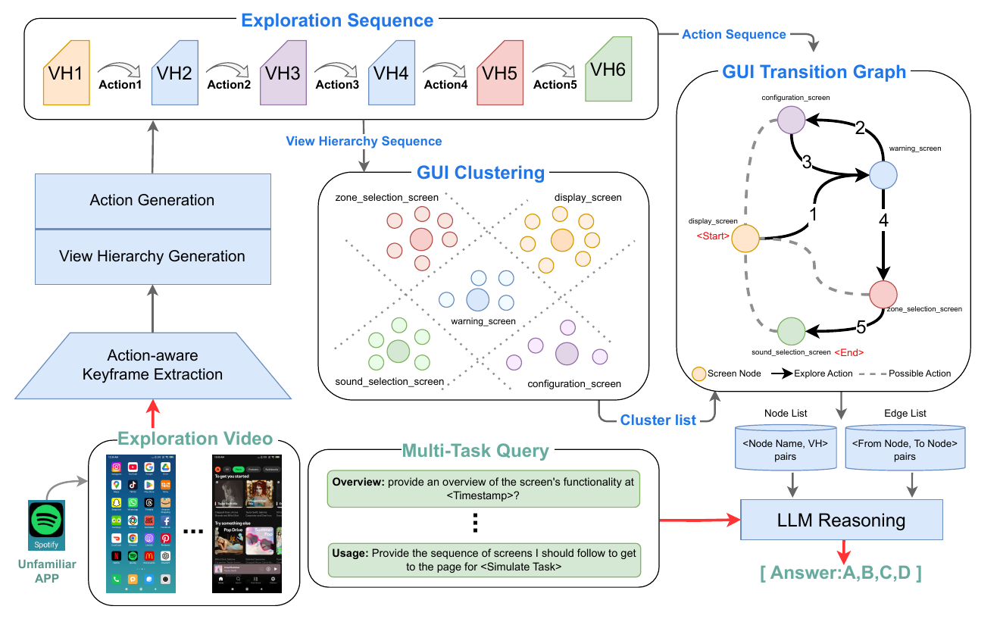

## Overview

How can a GUI agent understand an unfamiliar app before being asked to use it? **GUI-Xplore** studies an exploration-then-reasoning approach: an agent receives a recorded exploration of an app and uses that experience to answer questions about its screens, functions, and interaction sequences.

This was part of my undergraduate research in early 2025, under the supervision of Prof. Chongyang Zhang. I am a coauthor of the paper, which connects my earlier work on digital interfaces with my current interest in agents that learn through interaction.

**Authors:** Yuchen Sun, Shanhui Zhao, Tao Yu, Hao Wen, **Samith Va**, Mengwei Xu, Yuanchun Li, Chongyang Zhang.

[Paper (arXiv, March 2025)](https://arxiv.org/abs/2503.17709) · [Code and dataset repository](https://github.com/921112343/GUI-Xplore)

## Why exploration helps

Apps can offer similar functions through very different layouts and navigation paths. Knowledge learned from one app does not always transfer to another. GUI-Xplore gives the agent app-specific context through a task-agnostic exploration video, allowing it to build an understanding of the environment before answering downstream queries.

*Figure 1 from the paper. Exploration supplies context about an unfamiliar app's structure and interaction logic. Click either figure to view it at full size.*

## Dataset and tasks

The dataset covers **312 apps** and **32,569 question-answer pairs**. It combines automated exploration of 207 apps with manual exploration of 105 apps, spanning six broad software domains. Five tasks probe different levels of understanding:

| Task | What the agent must understand |
| --- | --- |
| Application Overview | The app's overall functions and capabilities. |
| Page Analysis | The purpose of an individual screen. |
| Application Usage | A sequence of screens needed to complete a task. |
| Action Recall | When a particular action occurred in the exploration. |
| Action Sequence Verification | The order and relationships of specified actions. |

These tasks use five-way multiple-choice questions, making it possible to compare performance across app understanding and interaction reasoning.

## Xplore-Agent

The paper introduces **Xplore-Agent**, a two-stage baseline that turns an exploration video into a structured representation of the app.

1. **Action-aware GUI modeling:** Extract keyframes around interface actions, generate simplified view hierarchies, and describe transitions between screens.
2. **Graph-guided environment reasoning:** Cluster related screens into nodes of a GUI transition graph, connect them through actions, and provide the graph as context for language-model reasoning.

*Figure 3 from the paper. The transition graph converts a linear exploration history into a representation of the app's navigation structure.*

## Reported results

On the paper's cross-app automation test set of **500 operations across 20 apps**, Xplore-Agent achieved the following results (Table 2):

| Method | Element accuracy | Operation accuracy | Step success rate |
| --- | ---: | ---: | ---: |
| CogAgent | 17.18% | 73.54% | 15.80% |
| Xplore-Agent | **30.73%** | **84.63%** | **30.39%** |

Across the five question-answering tasks, Xplore-Agent reached **64.24% average accuracy**, compared with 59.39% for the best reported GPT configuration and 57.97% for VideoTree (Table 3). These are the paper's reported benchmark results.

The results also reveal a clear limitation: understanding app functions and individual screens is easier than reasoning about action histories and ordering. Xplore-Agent scored 24.36% on Action Recall and 36.54% on Action Sequence Verification. The main benchmark evaluates textual answers; it does not establish reliable end-to-end task execution in live apps.

## Connection to my current research

This work helped shape my interest in how agents acquire environment-specific knowledge through exploration. The same question motivates my current research in embodied AI: how can an agent turn observations and interaction history into useful knowledge for reasoning and action?

*Figures and results are from the linked GUI-Xplore paper, arXiv:2503.17709v1 (2025).*
