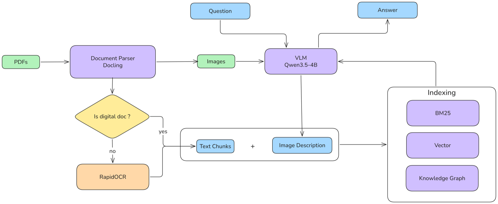
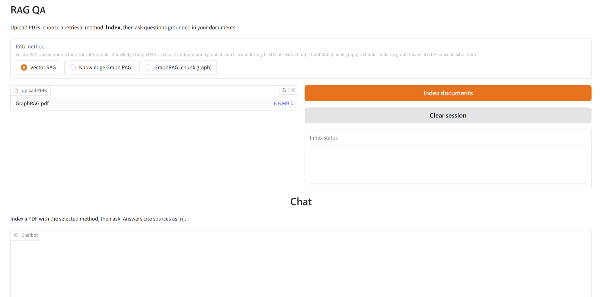
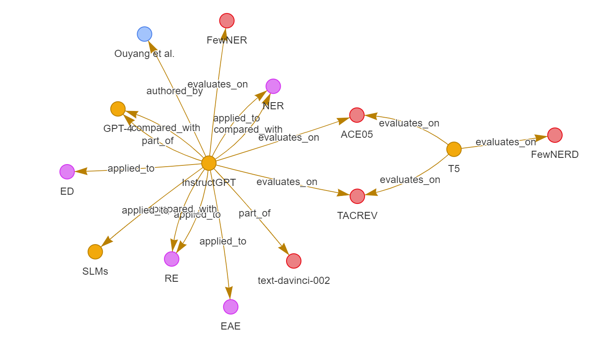
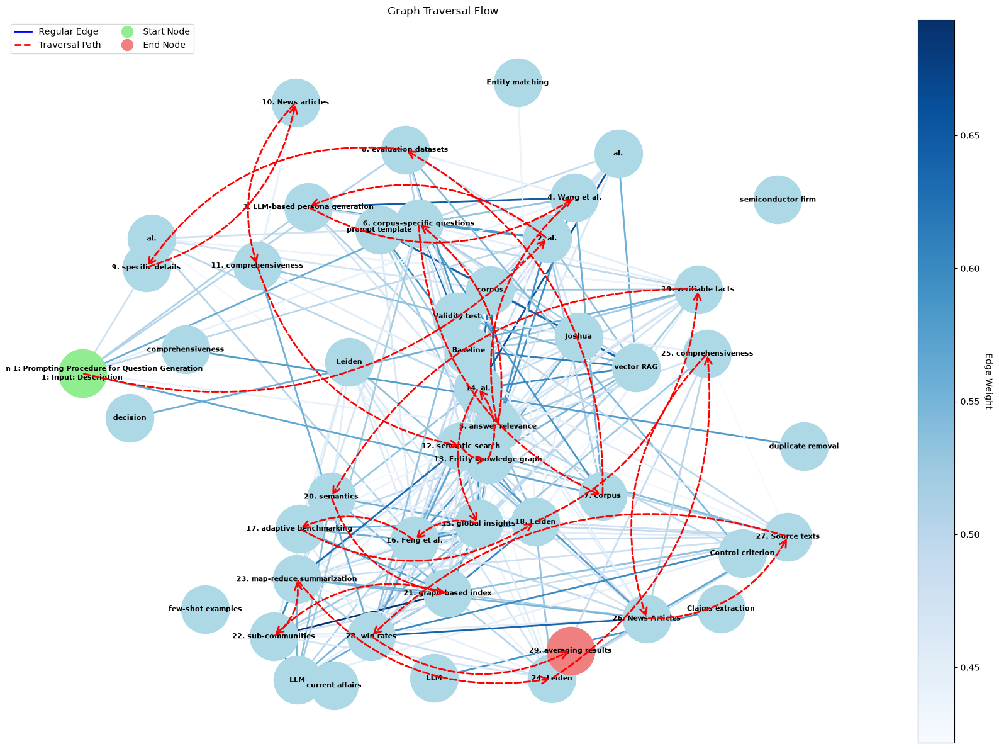
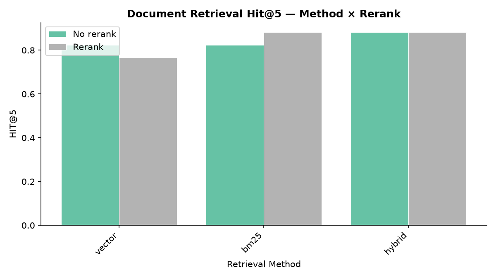
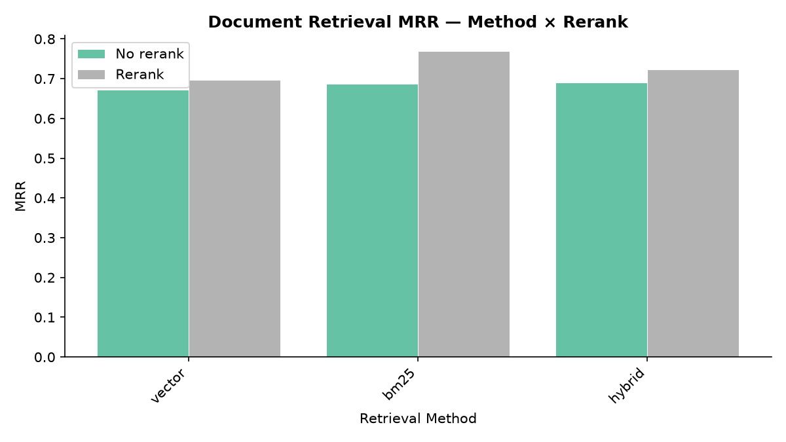
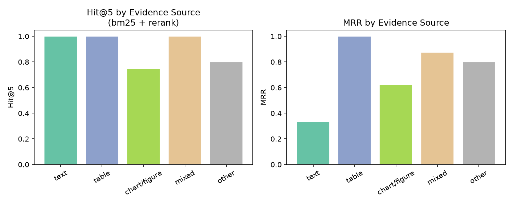

## Overview

This project turns academic PDFs into a searchable multimodal knowledge base. Docling parses page structure, a local vision-language model describes images and tables, and the resulting text and visual evidence are indexed through three complementary paths: Vector RAG, knowledge-graph fusion RAG, and GraphRAG.

*The report's multimodal ingestion and retrieval architecture.*

## Interactive workflow

The prototype provides one interface for uploading PDFs, building a session-level index, switching retrieval methods, and asking grounded questions with cited evidence.

## Method

- **Multimodal parsing:** Docling preserves page layout while a Qwen3.5-4B vision-language model produces retrieval-oriented descriptions for images and tables.
- **Vector RAG:** BM25 and dense embeddings provide candidate evidence; Qwen3-Reranker-4B reorders the top candidates before generation.
- **Knowledge-graph fusion:** LLM-extracted entities and relations are linked to the query, expanded locally, and fused with text evidence.
- **GraphRAG:** Document chunks become graph nodes connected by embedding similarity and shared concepts, then bounded traversal expands the candidate set before reranking.

*A local view of the extracted entity-relation graph.*

*Bounded graph traversal connects related evidence while limiting context dilution.*

## Results

The main evaluation used six academic papers and 17 questions spanning list, numeric, string, float, and unanswerable formats. GraphRAG achieved the strongest overall result in that run, driven primarily by reliable refusal when evidence was insufficient:

| Retrieval path | Accuracy | User score (1–5) | Hallucination rate | Latency (ms) | Unanswerable accuracy |
| --- | ---: | ---: | ---: | ---: | ---: |
| Vector RAG | 0.3529 | 2.412 | 0.5294 | 1849.15 | 0.4000 |
| KG-fusion RAG | 0.2353 | 1.941 | 0.4118 | 1352.89 | 0.6000 |
| GraphRAG | **0.5294** | **2.882** | **0.1176** | **1082.63** | **1.0000** |

BM25 with reranking was the strongest retrieval diagnostic configuration (Hit@5 0.882, MRR 0.770). Evidence-source analysis exposed the remaining bottleneck: chart and figure questions were harder to retrieve than text, table, or mixed-evidence questions.

On a larger 47-question set, GraphRAG no longer led on raw accuracy (0.3617 versus 0.3830 for Vector RAG), but its hallucination rate remained lower (0.2553 versus 0.4255). The results point to the next improvements: structured visual extraction, numeric-aware retrieval, better condition checking, and confidence calibration beyond retrieval scores.

## Takeaway

The project demonstrates that graph structure can improve evidence calibration and refusal behavior, but it cannot recover visual details that were never represented during parsing. The strongest path forward is a tighter multimodal representation paired with hybrid lexical, dense, and graph retrieval.
