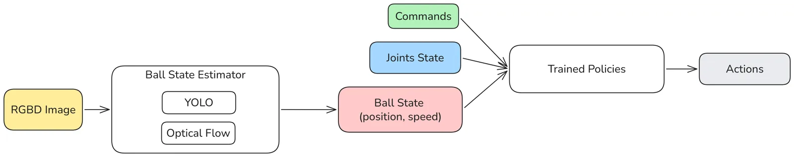
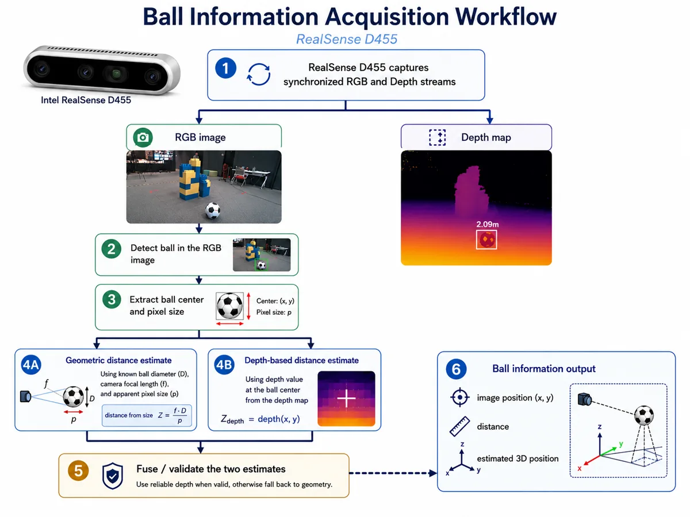

## Overview

This project gives a Booster T1 humanoid the perception and locomotion skills to follow a football autonomously. It uses onboard RGB-D vision to estimate the ball position and learned policies to control the robot.

*The perception and control pipeline.*

## Key Contributions

- Trained humanoid soccer policies in Isaac Lab and validated them in MuJoCo.
- Built an RGB-D pipeline for estimating the ball's 3D position.
- Deployed the perception-control loop on a physical Booster T1.
- Identified ankle dynamics as the largest sim-to-real mismatch.

## Simulation Transfer

<figure class="project-video">
  <video controls preload="metadata" playsinline loop muted>
    <source src="sim2sim-two-policies.webm" type="video/webm">
    <source src="sim2sim-two-policies.mp4" type="video/mp4">
    Your browser does not support embedded video.
  </video>
  <figcaption>Learned skills validated through sim-to-sim transfer.</figcaption>
</figure>

## Ball Estimation

The RealSense D455 provides synchronized RGB and depth streams. The estimator detects the ball, combines depth with an image-based geometric estimate, and projects the result into a 3D position for the policy.

## Physical Demo

<figure class="project-video">
  <video controls preload="metadata" playsinline poster="ball-chasing-poster.jpg">
    <source src="ball-chasing-demo.webm" type="video/webm">
    <source src="ball-chasing-demo.mp4" type="video/mp4">
    Your browser does not support embedded video.
  </video>
  <figcaption>The physical robot reorients and follows a moving football using onboard perception.</figcaption>
</figure>

## Limitations

Depth becomes unreliable at close range, the ball can leave the camera view, and gait stability remains sensitive to ankle dynamics. Ball-velocity estimation and multi-robot coordination are planned next steps.
